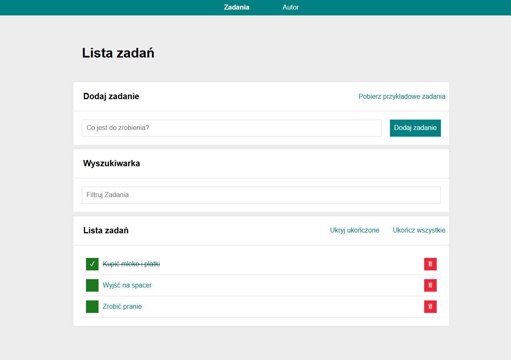
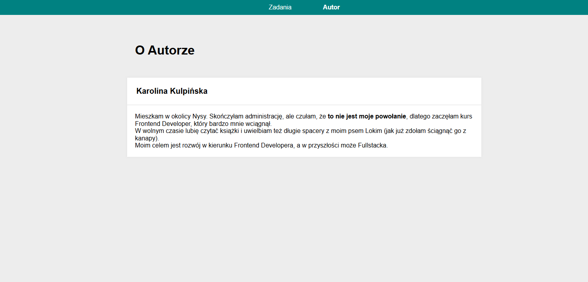

# Task List 

## [LIVE DEMO](https://karolina-kulpinska.github.io/todo-list-react/)

# Get Stuff Done!

Hey there! Welcome to my simple but powerful To-Do List app. It's built to help you quickly set and crush your daily goals.

## 🚀 Key Features You'll Love

* **Quick Add:** Easily throw new tasks onto the list.
* **Mark Complete:** Toggle tasks as done with a quick click.
* **Bulk Actions:** Finish up your day by marking everything as complete!
* **Filtering:** Hide those completed tasks to focus on what’s left.

## ⚙️ Core Technology Stack

This project is a React application powered by modern state management and data storage solutions. It's robust, fast, and scalable.

| Technology | Why We Used It |
| :--- | :--- |
| **React.js** | For building a snappy, component-based user interface. |
| **Redux Toolkit (RTK)** | This is the engine! It manages the entire application state (all your tasks) in a predictable way. No more tangled local state! |
| **Styled Components** | For writing clean, modular CSS directly within our JavaScript components. |

## 📚 Available Scripts

In the project directory, you can run:

`npm start`

Runs the app in the development mode. Open [http://localhost:3000](http://localhost:3000) to view it in your browser. The page will reload when you make changes.

`npm run build`

Builds the app for production to the `build` folder. Your app is ready to be deployed!

`npm run eject`

**Note:** this is a one-way operation. We don't recommend this for most people, but the option is there if you need full, low-level control over the configuration.